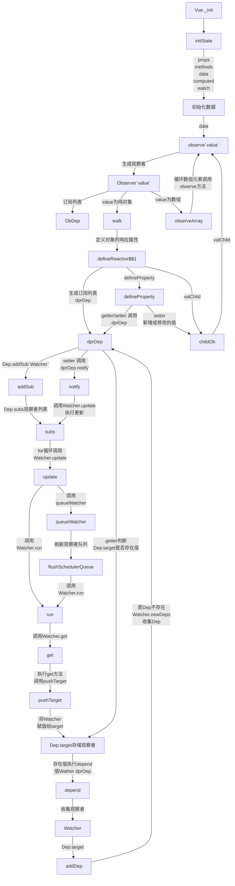

```mermaid
  graph TD;
  Vue._init -->initState
  initState -->|props<br/>methods<br/>data<br/>computed<br/>watch|初始化数据
  初始化数据 -->|data| observe`value`

  depend --> |收集观察者| Watcher
  Watcher -->|Dep.target| addDep
  update -->|调用<br/>Watcher.run| run
  run -->|调用Watcher.get| get
  update -->|调用<br/>queueWatcher| queueWatcher
  queueWatcher -->|刷新观察者队列| flushSchedulerQueue
  flushSchedulerQueue --> |调用<br/>Watcher.run| run
  get -->|执行get方法<br/>调用pushTarget| pushTarget
  addDep -->|若Dep不存在<br/>Watcher.newDeps<br/>收集Dep| dprDep
  dprDep -->|Dep.addSub`Watcher`| addSub
  addSub -->|Dep.subs观察者列表|subs
  subs -->|for循环调用<br/>Watcher.update| update

  pushTarget --> |将Watcher<br/>赋值给target| Dep.target存储观察者

  observe`value` -->|生成观察者| Observer`value`
  Observer`value` -->|订阅列表| ObDep
  Observer`value` -->|value为纯对象| walk
  walk -->|定义对象的响应属性| defineReactive$$1
  defineReactive$$1 -->|生成订阅列表<br>dprDep| dprDep
  defineReactive$$1 -->|defineProperty| defineProperty
  defineProperty -->|getter/setter 调用<br/> dprDep| dprDep
  defineProperty -->|setter<br/>新增或修改的值| childOb
  dprDep -->|getter判断<br/>Dep.target是否存在值| Dep.target存储观察者
  dprDep -->|setter 调用<br/>dprDep.notify| notify
  notify -->|调用Watcher.update<br/>执行更新| subs
  Dep.target存储观察者 --> |存在值执行depend<br/>值Wather dprDep| depend
  defineReactive$$1 -->|valChild| childOb
  childOb -->|valChild| observe`value`
  Observer`value` -->|value为数组| observeArray
  observeArray -->|循环数组元素调用<br/>observe方法| observe`value`
```